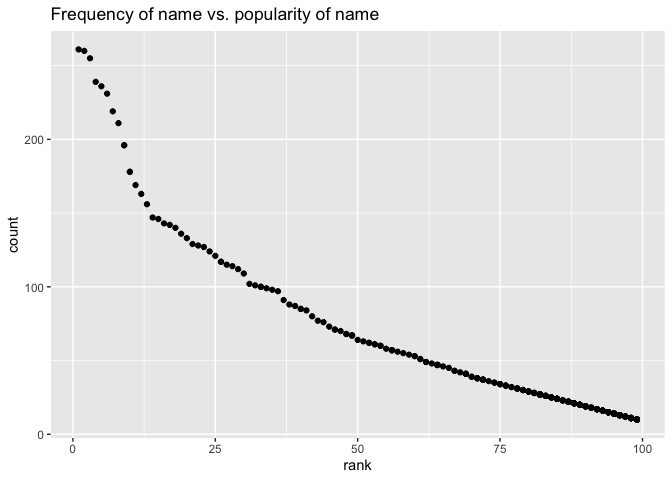

P8105 Homework 2
================
Heidi Lumish

## Problem 1

#### Set up the Mr. Trash Wheel data set

Here we will read in the Mr. Trash Wheel Excel sheet and clean the data.

``` r
trash_wheel_df =
  read_excel(
    "./data/Trash-Wheel-Collection-Totals-7-2020-2.xlsx",
    sheet = "Mr. Trash Wheel",
    range = "A2:N408") %>% 
  janitor::clean_names() %>% 
  drop_na(dumpster) %>% 
  mutate(sports_balls = as.integer(sports_balls))
```

#### Set up the precipitation data set

Next we will read in and clean the precipitation data for 2018 and 2019.
Then we will combine the 2018 and 2019 precpitation data sets into a new
data frame.

``` r
precipitation_2018 =
  read_excel(
    "./data/Trash-Wheel-Collection-Totals-7-2020-2.xlsx",
    sheet = "2018 Precipitation",
    range = "A2:B14") %>% 
  janitor::clean_names() %>% 
  drop_na(total) %>%
  rename("2018" = total)

precipitation_2019 =
  read_excel(
    "./data/Trash-Wheel-Collection-Totals-7-2020-2.xlsx",
    sheet = "2019 Precipitation",
    range = "A2:B14") %>% 
  janitor::clean_names() %>% 
  drop_na(total) %>%
  rename("2019" = total)

precipitation_df =
  left_join(precipitation_2018, precipitation_2019, by = "month") %>% 
  mutate(month = month.name[month])
```

#### Summarize the Mr. Trash Wheel data set

Mr. Trash Wheel is a “water-wheel vessel that removes trash from the
Inner Harbor in Baltimore, Maryland.” The Mr. Trash Wheel data set
contains information on 345 dumpsters, with litter collected between
2014 and 2019. There was a total of 1124.53 tons of litter, with a
volume of 5362 cubic yards, removed during this time. The type of litter
collected included 646245 plastic bottles, 737347 foam containers, 8746
glass bottles, 451862 grocery bags, 613794 chip bags, and 4066 sports
balls. The median number of sports balls collected each year was 6 in
2014, 16 in 2015, 26 in 2016, 8 in 2017, 4 in 2018, and 9 in 2019.

#### Summarize the precipitation data set

The precipitation dataset summarizes the precipitation during 12 months
in 2018 and 2019. The total precipitation between January and December
2018 was 70.33 inches. The median monthly precipitation was 5.455
inches. The maximum monthly precipitation in 2018 was 10.47 inches and
occurred during the month of September. For 2019, precipitation data is
available only between January and June. The total precipitation in 2019
was 33.95 inches. The median monthly precipitation was 3.335 and the
maximum monthly precipitation was 5.45 inches and occurred in March.

## Problem 2

#### Import and clean the pols-month file

First, we will import and clean the data in pols-month.csv. Below is the
code to convert the variable “mon” to separate “day,” “month,” and
“year” variables. In addition, the code below creates a new variable
“president” with levels “gop” and “dem,” and then removes the prez\_dem,
prez\_gop, and day variables.

``` r
pols_df = read_csv("./data/pols-month.csv") %>% 
  janitor::clean_names() %>% 
  separate(mon,
           c("year", "month", "day"),
           sep = "([-])",
           convert = TRUE) %>% 
  mutate(month = month.name[month]) %>% 
  mutate(president = ifelse(prez_dem == "1", "dem", "gop")) %>% 
  select(-prez_dem, -prez_gop, -day) %>% 
  relocate(year, month, president)
```

#### Import and clean the snp file

Next we will import and clean the data in the snp.csv file, following
similar methods to the pols-month file.

``` r
snp_df = read_csv("./data/snp.csv") %>% 
  janitor::clean_names() %>%
  mutate(date = mdy(date)) %>% 
  separate(date,
           c("year", "month", "day"),
           sep = "([-])",
           convert = TRUE) %>%
  mutate(year = ifelse(
    year>2021, year - 100, year)) %>% 
  mutate(month = month.name[month]) %>% 
  select(-day) %>%
  relocate(year, month)
```

#### Import and clean the unmployment file

Next we will import and clean the data in the unemployment file.

``` r
unemployment_df = read_csv("./data/unemployment.csv") %>% 
  janitor::clean_names() %>% 
  pivot_longer(
    jan:dec,
    names_to = "month",
    values_to = "percent"
  )%>% 
  mutate(
    month =
           case_when(
             month == "jan" ~ "January",
             month == "feb" ~ "February",
             month == "mar" ~ "March",
             month == "apr" ~ "April",
             month == "may" ~ "May",
             month == "jun" ~ "June",
             month == "jul" ~ "July",
             month == "aug" ~ "August",
             month == "sep" ~ "September",
             month == "oct" ~ "October",
             month == "nov" ~ "November",
             month == "dec" ~ "December"))
```

#### Merge the three data sets: pols, snp, and unemployment

Finally, we will merge the three data sets together.

``` r
five_thirty_eight_df =
  left_join(pols_df, snp_df, by = c("year", "month")) %>% 
              left_join(., unemployment_df, by = c("year", "month"))
```

#### Summary of the FiveThirtyEight data set

The FiveThirtyEight data set combines three files: pols-month, snp, and
unemployment. The pols-month dataset included 822 observations of 9
variables, with data collected between 1947 and 2015. It incorporated
information on the number of democratic and republican presidents,
governors, senators, and representatives on a given date, based on
polling information.

The snp dataset included 787 observations of 3 variables, with data
collected between 1950 and 2015. The data provided information about the
Standard & Poor’s stock market index, specifically the closing values of
the S&P stock index on the associated date. The lowest S&P closing value
during this period was 17.05, the highest closing value was 2107.39 and
the median closing value was 138.53.

The unemployment data set included 816 observations of 3 variables, with
data collected between 1948 and 2015. The data provide information on
the percentage of unemployment per month. The lowest unemployment rate
during this period was 2.5%, the highest rate was 10.8% and the median
unemployment rate was 5.6%.

The combined FiveThirtyEight data set has 822 observations and 11
columns, and it includes data collected between 1947 and 2015.

## Problem 3

First we will load and clean the Baby Names data set.

``` r
baby_names_df = read_csv("./data/Popular_Baby_Names.csv") %>% 
  janitor::clean_names() %>% 
  mutate(
    childs_first_name = str_to_title(childs_first_name),
    ethnicity =
           case_when(
             ethnicity == "ASIAN AND PACIFIC ISLANDER" ~ "Asian and Pacific Islander",
             ethnicity == "ASIAN AND PACI" ~ "Asian and Pacific Islander",
             ethnicity == "WHITE NON HISPANIC" ~ "Non-Hispanic White",
             ethnicity == "WHITE NON HISP" ~ "Non-Hispanic White",
             ethnicity == "HISPANIC" ~ "Hispanic",
             ethnicity == "BLACK NON HISP" ~ "Non-Hispanic Black",
             ethnicity == "BLACK NON HISPANIC" ~ "Non-Hispanic Black")
  ) %>%
  distinct()
```

#### Table of most popular baby names for girls

This code chunk will produce a table showing the rank in popularity of
the name “Olivia” as a female baby name over time, by ethnicity.

``` r
olivia_df = baby_names_df %>%
  filter(childs_first_name == "Olivia") %>% 
  select(-gender, -childs_first_name, -count) %>% 
  arrange(year_of_birth) %>% 
  pivot_wider(
    names_from = "year_of_birth",
    values_from = "rank"
  ) %>% 
  arrange(ethnicity)

colnames(olivia_df) = str_to_title(colnames(olivia_df))

knitr::kable(
  olivia_df[1:4, ],
  caption = ,
  align = "lcccccc")
```

<table>
<thead>
<tr>
<th style="text-align:left;">
Ethnicity
</th>
<th style="text-align:center;">
2011
</th>
<th style="text-align:center;">
2012
</th>
<th style="text-align:center;">
2013
</th>
<th style="text-align:center;">
2014
</th>
<th style="text-align:center;">
2015
</th>
<th style="text-align:center;">
2016
</th>
</tr>
</thead>
<tbody>
<tr>
<td style="text-align:left;">
Asian and Pacific Islander
</td>
<td style="text-align:center;">
4
</td>
<td style="text-align:center;">
3
</td>
<td style="text-align:center;">
3
</td>
<td style="text-align:center;">
1
</td>
<td style="text-align:center;">
1
</td>
<td style="text-align:center;">
1
</td>
</tr>
<tr>
<td style="text-align:left;">
Hispanic
</td>
<td style="text-align:center;">
18
</td>
<td style="text-align:center;">
22
</td>
<td style="text-align:center;">
22
</td>
<td style="text-align:center;">
16
</td>
<td style="text-align:center;">
16
</td>
<td style="text-align:center;">
13
</td>
</tr>
<tr>
<td style="text-align:left;">
Non-Hispanic Black
</td>
<td style="text-align:center;">
10
</td>
<td style="text-align:center;">
8
</td>
<td style="text-align:center;">
6
</td>
<td style="text-align:center;">
8
</td>
<td style="text-align:center;">
4
</td>
<td style="text-align:center;">
8
</td>
</tr>
<tr>
<td style="text-align:left;">
Non-Hispanic White
</td>
<td style="text-align:center;">
2
</td>
<td style="text-align:center;">
4
</td>
<td style="text-align:center;">
1
</td>
<td style="text-align:center;">
1
</td>
<td style="text-align:center;">
1
</td>
<td style="text-align:center;">
1
</td>
</tr>
</tbody>
</table>

#### Table of most popular baby names for boys

This code chunk will produce a table showing the most popular boys name
(ranked \#1) by ethnicity over time:

``` r
boy_names = baby_names_df %>%
  filter(gender == "MALE", rank == 1) %>% 
  select(-gender, -rank, -count) %>% 
  arrange(year_of_birth) %>% 
  pivot_wider(
    names_from = "year_of_birth",
    values_from = "childs_first_name"
  ) %>% 
  arrange(ethnicity)

colnames(boy_names) = str_to_title(colnames(boy_names))

knitr::kable(
  boy_names[1:4, ],
  caption = ,
  align = "lcccccc")
```

<table>
<thead>
<tr>
<th style="text-align:left;">
Ethnicity
</th>
<th style="text-align:center;">
2011
</th>
<th style="text-align:center;">
2012
</th>
<th style="text-align:center;">
2013
</th>
<th style="text-align:center;">
2014
</th>
<th style="text-align:center;">
2015
</th>
<th style="text-align:center;">
2016
</th>
</tr>
</thead>
<tbody>
<tr>
<td style="text-align:left;">
Asian and Pacific Islander
</td>
<td style="text-align:center;">
Ethan
</td>
<td style="text-align:center;">
Ryan
</td>
<td style="text-align:center;">
Jayden
</td>
<td style="text-align:center;">
Jayden
</td>
<td style="text-align:center;">
Jayden
</td>
<td style="text-align:center;">
Ethan
</td>
</tr>
<tr>
<td style="text-align:left;">
Hispanic
</td>
<td style="text-align:center;">
Jayden
</td>
<td style="text-align:center;">
Jayden
</td>
<td style="text-align:center;">
Jayden
</td>
<td style="text-align:center;">
Liam
</td>
<td style="text-align:center;">
Liam
</td>
<td style="text-align:center;">
Liam
</td>
</tr>
<tr>
<td style="text-align:left;">
Non-Hispanic Black
</td>
<td style="text-align:center;">
Jayden
</td>
<td style="text-align:center;">
Jayden
</td>
<td style="text-align:center;">
Ethan
</td>
<td style="text-align:center;">
Ethan
</td>
<td style="text-align:center;">
Noah
</td>
<td style="text-align:center;">
Noah
</td>
</tr>
<tr>
<td style="text-align:left;">
Non-Hispanic White
</td>
<td style="text-align:center;">
Michael
</td>
<td style="text-align:center;">
Joseph
</td>
<td style="text-align:center;">
David
</td>
<td style="text-align:center;">
Joseph
</td>
<td style="text-align:center;">
David
</td>
<td style="text-align:center;">
Joseph
</td>
</tr>
</tbody>
</table>

#### Scatterplot

The following code chunk can be used to generate a scatterplot showing
the number of children with a name against the rank in popularity of
that name, among male, white, non-Hispanic children born in 2016.

``` r
white_boy_names = baby_names_df %>%
  filter(gender == "MALE", ethnicity == "Non-Hispanic White", year_of_birth == "2016") 

ggplot(white_boy_names, aes(x = rank, y = count)) +
  geom_point(color = "blue") +
  labs(
    title = "Frequency of baby name vs. popularity of name",
    x = "Rank of baby name",
    y = "Frequency of baby name")+
  theme_minimal()
```


